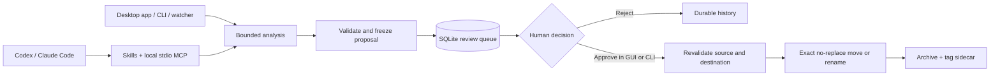

<p align="center">
  
</p>

<h1 align="center">WatchDock</h1>

<p align="center"><strong>Give agents a review queue&mdash;not unchecked file moves.</strong></p>

<p align="center">
  WatchDock turns file-organization requests into durable, inspectable proposals.<br>
  People work through the desktop app or CLI; coding agents use portable skills and a local MCP server.
</p>

<p align="center">
  <a href="https://github.com/Z-MarkUs/WatchDock/actions/workflows/ci.yml"></a>
  <a href="https://pypi.org/project/watchdock/"></a>
  <a href="https://pypi.org/project/watchdock/"></a>
  <a href="https://github.com/Z-MarkUs/WatchDock/releases/latest"></a>
  <a href="https://github.com/Z-MarkUs/WatchDock/blob/main/LICENSE"></a>
</p>

<p align="center">
  <a href="#quick-start">Quick start</a> &middot;
  <a href="https://github.com/Z-MarkUs/WatchDock/blob/main/docs/AGENT_INTEGRATION.md">Agent setup</a> &middot;
  <a href="https://github.com/Z-MarkUs/WatchDock/blob/main/docs/ARCHITECTURE.md">Architecture</a> &middot;
  <a href="https://github.com/Z-MarkUs/WatchDock/blob/main/docs/SECURITY.md">Security</a>
</p>

> [!CAUTION]
> WatchDock is alpha software that can rename or move files. Start with a test
> folder, keep a backup, and use the default human-in-the-loop (`hitl`) mode
> until you have reviewed its behavior with your own files.

## One safety boundary, three interfaces

| Interface | Best for | What it can do |
| --- | --- | --- |
| **Desktop app** | Visual setup and review | Configure folders, run the monitor, inspect proposals, approve, reject, and retry |
| **CLI** | Scripts and explicit operations | Dry-run, queue, inspect, approve, reject, retry, recover, and diagnose |
| **Agent gateway** | Codex, Claude Code, and MCP clients | Analyze, queue, list, inspect, reject, retry, and diagnose&mdash;with no approval or source-file execution tool |

For an agent-queued file, the expected path is deliberately asymmetric:

1. The agent analyzes one file inside a configured watched root.
2. WatchDock freezes the proposal and a SHA-256 source fingerprint in SQLite.
3. The source stays in place while a human reviews the exact destination.
4. A separate GUI or CLI approval revalidates the source and executes the move.

The agent integration is a constrained interface, not a sandbox around the
agent. An agent that independently has shell or filesystem tools may have other
ways to change files; see the
[agent trust boundary](https://github.com/Z-MarkUs/WatchDock/blob/main/docs/AGENT_INTEGRATION.md#security-boundary).

<p align="center">
  
</p>

<p align="center"><em>The Windows desktop app, using a generic sandbox path and the default HITL workflow.</em></p>

## How the default review path works



The diagram shows the default HITL route and every agent-queued action. Core
WatchDock also has an optional `auto` mode for validated, high-confidence
provider results; rules fallback results can never execute automatically.

## Why this is more than a folder watcher

<p align="center">
  
</p>

- **Review-first by default.** A proposal is not a filesystem mutation.
- **Durable state.** CLI, GUI, watcher, and agents share a transactional SQLite
  queue with lifecycle history and atomic claims.
- **Fail-closed file handling.** WatchDock rejects symlink sources, stale
  fingerprints, and occupied reviewed destinations; watcher and agent routes
  additionally reject escapes from currently enabled watched roots.
- **Exact reviewed destinations.** Approval does not silently choose a new name
  if the reviewed destination is no longer available.
- **Bounded AI input.** Supported text previews are limited; binary formats are
  classified from metadata rather than uploaded as extracted content.
- **Offline fallback.** Missing credentials, missing SDKs, provider failures,
  and invalid output produce deterministic review-only proposals.
- **Cross-platform delivery.** The project tests Python 3.10&ndash;3.14 and builds
  CLI and GUI applications for Windows, macOS, and Linux.

The detailed invariants and trust boundaries live in
[Architecture](https://github.com/Z-MarkUs/WatchDock/blob/main/docs/ARCHITECTURE.md),
[Security](https://github.com/Z-MarkUs/WatchDock/blob/main/docs/SECURITY.md), and
[Agent evaluations](https://github.com/Z-MarkUs/WatchDock/blob/main/docs/AGENT_EVALS.md).

## Installation

WatchDock requires Python 3.10 or newer.

```console
python -m pip install --upgrade pip
python -m pip install watchdock
```

Choose only the optional capabilities you need:

```console
# OpenAI, or Ollama through an OpenAI-compatible endpoint
python -m pip install "watchdock[openai]"

# Anthropic
python -m pip install "watchdock[anthropic]"

# Local MCP server for coding-agent integrations
python -m pip install "watchdock[mcp]"

# MCP plus both cloud-provider SDKs
python -m pip install "watchdock[mcp,ai]"
```

PowerShell and Command Prompt need the quotes around requirements containing
brackets. Tkinter is included by most standard Python installers.

Agent/MCP support belongs to the 0.3.0 release line. If the PyPI badge above
still shows 0.2.x, install the current source checkout for agent testing:

```console
git clone https://github.com/Z-MarkUs/WatchDock.git
cd WatchDock
python -m pip install -e ".[mcp]"
```

Standalone CLI and GUI archives are available from
[GitHub Releases](https://github.com/Z-MarkUs/WatchDock/releases/latest). They
are currently unsigned. Published 0.2.x archives contain CLI and GUI only; the
0.3.0 release candidate adds a third, separately smoke-tested MCP executable.
Until that release is public and its assets are verified, install
`watchdock[mcp]` for `watchdock-mcp`.

## Quick start

Initialization and monitoring are explicit. Running `watchdock` without a
subcommand shows help and does not start a watcher.

```console
watchdock config init
watchdock config validate
watchdock doctor
watchdock gui
```

The generated configuration watches `~/Downloads` non-recursively, archives
under `~/Documents/Archive`, and uses `hitl` mode. Inspect it before choosing
**Start Monitor** in the GUI or running this foreground command:

```console
watchdock start
```

To see the review boundary without starting a watcher:

```console
watchdock process "/path/to/file.txt"          # dry run
watchdock process "/path/to/file.txt" --queue  # durable pending action
watchdock list-pending
watchdock approve ACTION_ID                     # separate human decision
```

For a no-credential sandbox, leave the generated provider key unset. WatchDock
uses its deterministic rules fallback, marks the result review-only, and keeps
the source in place until approval.

## Agent quick start

Install the MCP extra, initialize WatchDock, then add the version-pinned Codex
marketplace and plugin:

```console
python -m pip install "watchdock[mcp]"
watchdock config init
codex plugin marketplace add Z-MarkUs/WatchDock --ref v0.3.0
codex plugin add watchdock-agent@watchdock
```

The tagged commands are the preferred public install path once `v0.3.0` is
published. For release-candidate testing, substitute `--ref main`; the live
Codex flow remains a release gate. A direct `codex mcp add` setup is documented
as a development fallback.

The repository includes three portable workflows:
`watchdock-organize`, `watchdock-review`, and `watchdock-doctor`. The complete
guide covers the Codex and Claude Code marketplaces, direct MCP and individual
skill installation, custom configuration paths, all eight MCP tools, and their
exact side effects:

**[Set up WatchDock for coding agents &rarr;](https://github.com/Z-MarkUs/WatchDock/blob/main/docs/AGENT_INTEGRATION.md)**

Codex and Claude Code live end-to-end acceptance is intentionally tracked as a
release gate rather than claimed from manifest presence alone. See
[Agent evaluations](https://github.com/Z-MarkUs/WatchDock/blob/main/docs/AGENT_EVALS.md)
for the current evidence and remaining checks.

## Review modes

### Human-in-the-loop (`hitl`, default)

Every watcher result is stored as `pending`. Nothing is moved or renamed until
a human approves it in the CLI or GUI. Rejection records the decision without
touching the source. The agent gateway always queues for this separate review.

### Automatic (`auto`)

Core WatchDock can automatically apply a provider result only after structured
validation and a high-confidence result. Missing credentials, unavailable SDKs,
provider errors, invalid output, and deterministic fallback results remain
review-only. Test `auto` mode with a sandbox before using it on real folders.

## Configuration and state

The generated JSON is intentionally explicit. A portable example is available
at
[config.example.json](https://github.com/Z-MarkUs/WatchDock/blob/main/config.example.json).
Validation rejects duplicate watched paths and any enabled watched folder that
contains, equals, or is contained by the archive path.

Provider credentials should come from environment variables:

| Provider | Preferred variable | Compatible fallback |
| --- | --- | --- |
| OpenAI | `WATCHDOCK_OPENAI_API_KEY` | `OPENAI_API_KEY` |
| Anthropic | `WATCHDOCK_ANTHROPIC_API_KEY` | `ANTHROPIC_API_KEY` |

Default local state lives under `~/.watchdock`:

| Purpose | Path |
| --- | --- |
| Configuration | `~/.watchdock/config.json` |
| Review queue and history | `~/.watchdock/pending_actions.sqlite3` |
| Few-shot examples | `~/.watchdock/few_shot_examples.json` |
| Rotating log | `~/.watchdock/logs/watchdock.log` |

Set `WATCHDOCK_HOME` before starting WatchDock to relocate the entire default
state root. Passing `--config PATH` uses that configuration's parent directory
for the queue, examples, and logs.

Each non-empty tag list is written beside the organized file as
`filename.ext.watchdock.json`. It is a portable JSON sidecar, not an operating
system extended attribute.

## CLI map

Both `watchdock` and `wd` invoke the same CLI.

```text
watchdock --help                     watchdock --version
watchdock config init                watchdock config validate
watchdock config show                watchdock doctor
watchdock status [--json]            watchdock gui
watchdock start                      watchdock process FILE
watchdock process FILE --queue       watchdock process FILE --apply
watchdock list-pending [--all]       watchdock approve ACTION_ID
watchdock reject ACTION_ID           watchdock retry ACTION_ID
watchdock recover-stale              watchdock version --check
watchdock update                     watchdock-mcp [--config PATH]
```

`process FILE` is a dry run. `--queue` stores the frozen proposal. `--apply`
performs a new analysis and only executes a high-confidence provider result; it
refuses fallback results. `retry` returns a failed action to pending but does not
execute it. `recover-stale` marks uncertain old processing claims as failed for
manual reconciliation.

## Privacy and operational limits

For supported text files, WatchDock reads at most 5,000 UTF-8 characters locally
and includes at most 2,000 characters in a configured provider prompt. It does
not extract content from PDF, Office, image, audio, video, or archive files.

Agent tools can reveal absolute watched paths, proposed destinations, analysis,
errors, and action rows from requested lifecycle states to the connected agent client. That
client may itself use a remote model. The MCP server is local stdio, but local
transport does not mean the complete agent workflow is local or private.

Current limitations include no built-in undo, content deduplication, encryption,
binary-document understanding, background service, tray process, or signed
desktop applications. A file move and its sidecar write are not one filesystem
transaction. Review the full recovery guidance and residual risks in
[Security and privacy](https://github.com/Z-MarkUs/WatchDock/blob/main/docs/SECURITY.md).

## Project documentation

- [Agent integration](https://github.com/Z-MarkUs/WatchDock/blob/main/docs/AGENT_INTEGRATION.md)
- [Agent evaluation plan and evidence](https://github.com/Z-MarkUs/WatchDock/blob/main/docs/AGENT_EVALS.md)
- [Architecture](https://github.com/Z-MarkUs/WatchDock/blob/main/docs/ARCHITECTURE.md)
- [Security and privacy](https://github.com/Z-MarkUs/WatchDock/blob/main/docs/SECURITY.md)
- [Changelog](https://github.com/Z-MarkUs/WatchDock/blob/main/CHANGELOG.md)
- [Contributing](https://github.com/Z-MarkUs/WatchDock/blob/main/CONTRIBUTING.md)

## Author and license

Built by [Hehan Zhao](https://github.com/Z-MarkUs) and released under the
[MIT License](https://github.com/Z-MarkUs/WatchDock/blob/main/LICENSE).
