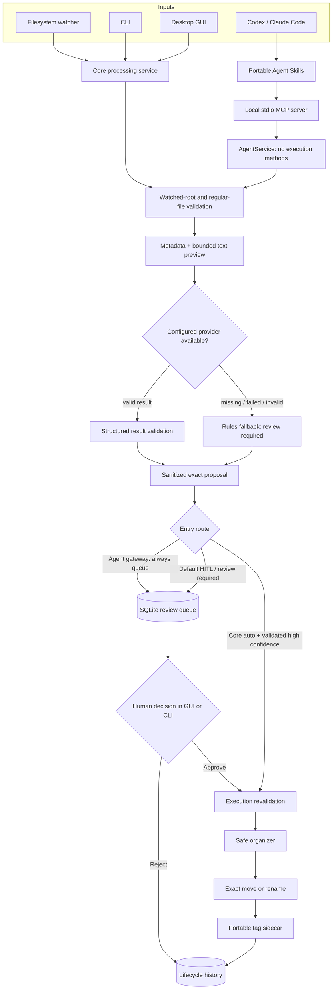
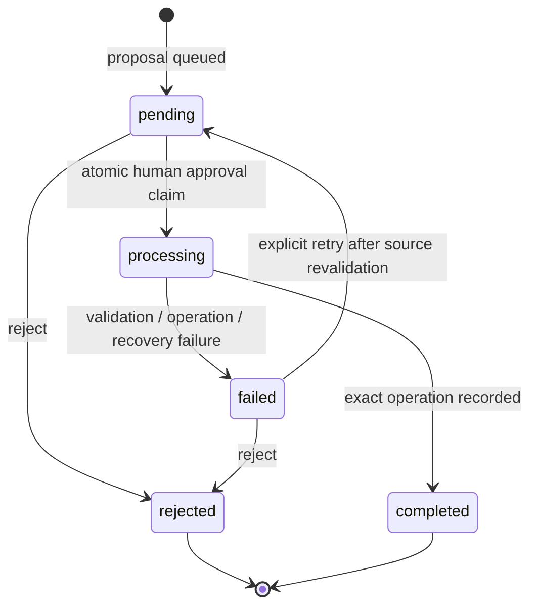

# Architecture

WatchDock is a review-first file-organization system with four entry surfaces:
the foreground watcher, explicit CLI commands, the desktop GUI, and a local MCP
gateway for coding agents. They converge on the same configuration, proposal,
organizer, and durable queue components.

## Processing and review flow

The optional core `auto` route does not apply to agent-queued actions. The MCP
gateway has no approval or organizer method, so its proposals enter the queue
even when the shared configuration names `auto` mode.

## Components

- `config.py` owns typed configuration, defaults, environment-key resolution,
  validation, and atomic JSON writes. It rejects watched-folder/archive overlap
  before processing starts.
- `watcher.py` wraps `watchdog`, filters temporary and managed files, debounces
  repeated events, waits for stability, and runs file work outside observer
  callbacks.
- `ai_processor.py` gathers bounded metadata and preview input, calls the
  selected provider, validates the result, and supplies the deterministic
  review-only fallback.
- `file_organizer.py` creates sanitized exact proposals and applies archive
  moves or in-place renames. It writes portable tag metadata beside the result.
- `pending_actions.py` persists actions and append-only lifecycle events in
  SQLite, atomically claims work, verifies source fingerprints, and records
  completed, rejected, and failed outcomes.
- `agent_service.py` is a structured facade that can analyze, queue, list,
  inspect, reject, retry, and diagnose. It deliberately has no approval or
  filesystem-execution method.
- `mcp_server.py` maps the eight agent-service operations to structured MCP v2
  tools over stdio. MCP is an optional dependency and is imported lazily.
- `main.py` exposes the CLI workflows and owns foreground service lifetime.
- `gui.py` provides in-process configuration, monitoring, examples, and human
  review using the same queue as the other interfaces.
- `integrations/watchdock-agent` contains the Codex and Claude Code plugin
  manifests, portable skills, MCP launch configuration, and brand assets.

## Agent proposal integrity and deduplication

The agent route performs containment checks before analysis and repeats them
after provider I/O. It compares the source identity across that interval so a
file replaced during a slow provider call is not queued under the earlier
review context.

`queue_file` captures size, nanosecond mtime, and a full-file SHA-256 digest.
Within one immediate SQLite transaction, WatchDock either inserts the action or
returns an existing `pending`/`processing` action for the same canonical source
and fingerprint. This prevents ordinary client retries and concurrent agent
requests from multiplying active reviews.

SHA-256 is used as a content-integrity check. It is not a malware verdict,
signature, or proof of origin. Historical CLI/watcher actions can have metadata
fingerprints without a digest; source validation follows the fingerprint stored
with each action.

## State machine and concurrency

SQLite uses transactions, a busy timeout, full synchronous writes, and WAL mode
when supported. A claim is an atomic state transition, so concurrent CLI and GUI
processes cannot normally claim the same pending action. A failed action remains
auditable and must be returned to pending explicitly before another approval.

Startup marks processing claims older than 24 hours failed for reconciliation;
`recover-stale` exposes the same conservative transition with an explicit age.
A crash can occur after a filesystem operation but before completion is recorded,
so recovery records uncertainty rather than guessing or replaying the action.

The default state root is `~/.watchdock`, overridden by `WATCHDOCK_HOME`.
Passing `--config PATH` uses that file's parent as the state root for the command
or MCP server. Configuration and example writers use temporary files plus atomic
replacement. Sidecars use exclusive creation so existing metadata is not
replaced.

## Filesystem execution boundary

Only core human approval or the separately configured core auto route can reach
the organizer. Immediately before a reviewed execution, WatchDock verifies:

- the source is a non-symlink regular file;
- lexical and resolved source paths remain inside an enabled watched root;
- the current source matches the reviewed fingerprint, including SHA-256 when
  present;
- a move destination remains inside the configured archive;
- a rename destination remains inside the source directory; and
- the exact reviewed destination is still unoccupied.

Destination and sidecar entries are created without replacing existing entries.
Windows-reserved names, separators, control characters, and traversal-like
components are sanitized. The archive, tag sidecars, and common partial-download
files are excluded from watching to prevent feedback loops.

## Trust boundaries

Watched filenames, text previews, few-shot examples, provider output, MCP tool
arguments, and agent instructions are all untrusted input.

- Text reads and provider excerpts are bounded and delimited.
- Provider output must match expected fields and types before it becomes a
  proposal.
- Proposed filesystem components are sanitized again by the organizer.
- Agent paths pass the same watched-root and regular-file checks used by core
  processing.
- The MCP tool inventory is intentionally non-executing, but it does not confine
  independent shell or filesystem tools granted by an agent host.

Cloud-provider requests cross the local machine boundary. MCP stdio stays local
between WatchDock and the client process, but the client can relay paths,
analysis, and action data to a remote model. The agent tool surface can expose
absolute watched, archive, state, source, and destination paths. See
[Agent integration](AGENT_INTEGRATION.md#exact-tool-effects) and
[Security](SECURITY.md) for the complete data-flow and side-effect inventory.

## Residual limitations

These controls reduce accidental and agent-proposed file mutations; they do not
replace backups or create a filesystem transaction. WatchDock has no built-in
undo, and a sidecar failure can occur after a move succeeds. An active-action
deduplication transaction is not a universal exactly-once guarantee across all
external client and crash scenarios.
